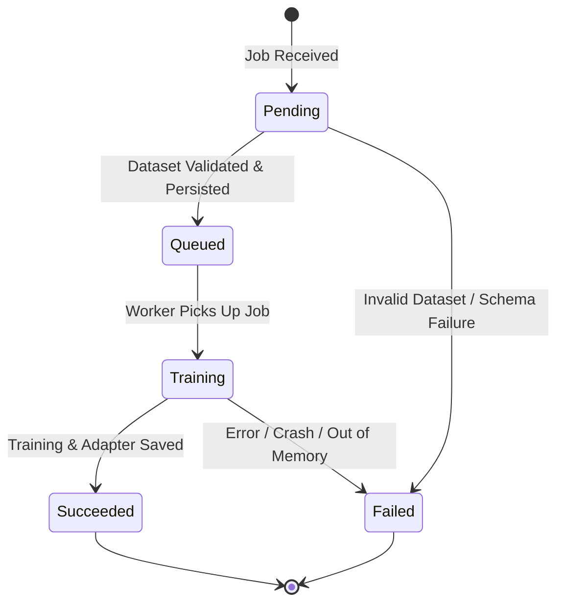

# Event-Driven "Fine-Tuning as a Service" (FTaaS)

An enterprise-grade, asynchronous, event-driven ML platform demonstrating a polyglot microservice pattern (.NET 10 and Python), decoupled compute orchestration, experiment telemetry (MLflow), parameter-efficient fine-tuning (PEFT/LoRA), and dynamic model serving.

---

## 1. System Architecture Overview

```mermaid
flowchart TD
    subgraph Client["Client Applications / Ingestion"]
        C[Client / CLI / API Caller] -->|1. POST /api/v1/jobs multipart file or URI| API[.NET 10 Ingestion Gateway]
        C -->|GET /api/v1/jobs/{id}| API
        C -->|POST /api/v1/inference/compare| API
    end

    subgraph Broker["Messaging Layer (RabbitMQ AMQP)"]
        API -->|2. Publish: 'finetune.job.requested'| RMQ[RabbitMQ Exchange / Queue]
        PW -.->|5. Publish: 'finetune.job.updated'| RMQ
        RMQ -.->|6. Consume status events| API
        RMQ -.->|DLX / Retry| DLQ[(Dead Letter Queue)]
    end

    subgraph Storage["Storage & Tracking"]
        API -->|Store dataset & compute SHA-256| DISK[(Data Storage / JSONL)]
        API <--> DB[(SQLite Job State Repository)]
        PW <--> MLF[MLflow Tracking Server]
        MLF <--> ART[(Artifact Store / LoRA Adapters)]
    end

    subgraph Compute["Training Compute Worker (Python)"]
        RMQ -->|3. Consume job| PW[Python Training Worker]
        PW -->|Load JSONL via datasetUri| DISK
        PW -->|Apply LoRA & Train| HF[SmolLM2-135M / TinyLlama Base]
        PW -->|4. Stream step loss & hardware metrics| MLF
        PW -->|Save adapter weights| ART
    end

    subgraph Serving["Dynamic Model Serving"]
        API -->|Proxy or Call| INF[Inference Engine]
        INF -->|Load Base Weights| HF
        INF -->|Mount LoRA Adapter by JobId or URI| ART
        INF -->|Return Side-by-Side Completions| API
    end
```

---

## 2. Core Architectural Principles & Trade-offs

1. **Polyglot Microservices**:
   - **.NET 10 Ingestion Gateway**: High-performance, strongly-typed REST API managing multipart dataset ingestion, schema validation, state machine enforcement, and AMQP publishing with correlation tracking.
   - **Python 3.12 Training Worker**: Specialized ML engine focusing strictly on compute-heavy PyTorch / Hugging Face PEFT fine-tuning, telemetry streaming, and artifact persistence.
2. **Decoupled Job Lifecycle & Out-of-Band Data Handling**:
   - Datasets are stored out-of-band as `.jsonl` files on disk/storage. Only the `datasetUri` and a cryptographic `datasetHash` (SHA-256) travel over the message broker, keeping message payloads lightweight.
   - Web requests return immediately with `Accepted (202)` and a unique `JobId`.
3. **Hardware-Adaptive & Local-First (Zero Cloud Cost)**:
   - Automated device detection (`mps` on Apple Silicon, `cuda` on Nvidia, or multi-threaded `cpu`).
   - Compact baseline models (`HuggingFaceTB/SmolLM2-135M` or `TinyLlama-1.1B`) fine-tuned via LoRA (rank 8, alpha 32) in 2–4 minutes locally.
4. **Observable MLOps & Distributed Tracing**:
   - Unified `JobId` correlation across HTTP headers, AMQP properties, Python structured logs, and MLflow experiment tags.
   - Step-level loss curves, learning rate, and duration recorded in MLflow.
5. **Resilience & Dead Lettering**:
   - Worker implements message acknowledgment (`ack`/`nack`) with retry policies and DLQ routing for poison messages.
   - Explicit state transitions with validation (`Pending` $\rightarrow$ `Queued` $\rightarrow$ `Training` $\rightarrow$ `Succeeded` / `Failed`).

---

## 3. Data Contracts & Event Schemas

### A. Job Submission API (`POST /api/v1/jobs`)
Supported input: `multipart/form-data` with dataset file or JSON body with `datasetUri`.

```json
{
  "jobName": "financial-sentiment-analysis",
  "baseModel": "HuggingFaceTB/SmolLM2-135M",
  "datasetUri": "file:///data/datasets/financial-sentiment-train.jsonl",
  "hyperparameters": {
    "epochs": 3,
    "batchSize": 4,
    "learningRate": 0.0002,
    "loraRank": 8,
    "loraAlpha": 32,
    "loraDropout": 0.05
  }
}
```

**Response (`202 Accepted`):**
```json
{
  "jobId": "f47ac10b-58cc-4372-a567-0e02b2c3d479",
  "jobName": "financial-sentiment-analysis",
  "status": "Queued",
  "baseModel": "HuggingFaceTB/SmolLM2-135M",
  "datasetHash": "e3b0c44298fc1c149afbf4c8996fb92427ae41e4649b934ca495991b7852b855",
  "createdAt": "2026-09-14T20:10:00Z"
}
```

### B. Broker Message Contract (`finetune.job.requested`)
Sent to exchange `ftaas.direct`, routing key `job.requested`.
```json
{
  "jobId": "f47ac10b-58cc-4372-a567-0e02b2c3d479",
  "jobName": "financial-sentiment-analysis",
  "baseModel": "HuggingFaceTB/SmolLM2-135M",
  "datasetPath": "datasets/f47ac10b.jsonl",
  "datasetHash": "e3b0c44298fc1c149afbf4c8996fb92427ae41e4649b934ca495991b7852b855",
  "hyperparameters": {
    "epochs": 3,
    "batchSize": 4,
    "learningRate": 0.0002,
    "loraRank": 8,
    "loraAlpha": 32,
    "loraDropout": 0.05
  },
  "submittedAt": "2026-09-14T20:10:00Z"
}
```

> **Note on Storage Paths**: `datasetPath` is resolved relative to the configured `DATA_ROOT` environment variable (default: `./data`), avoiding brittle host-specific absolute paths between containers and local processes.

### C. Status Event Contract (`finetune.job.updated`)
Sent to exchange `ftaas.direct`, routing key `job.updated`.
> **Throttling Policy**: While MLflow receives telemetry on every step, RabbitMQ status events are throttled to epoch boundaries (or every 10 steps) plus state transitions (`Training`, `Succeeded`, `Failed`) to prevent queue chattiness.

```json
{
  "jobId": "f47ac10b-58cc-4372-a567-0e02b2c3d479",
  "status": "Training",
  "sequenceNumber": 4,
  "progressPercent": 45.0,
  "currentStep": 45,
  "totalSteps": 100,
  "currentLoss": 0.321,
  "mlflowExperimentId": "1",
  "mlflowRunId": "9b1deb4d3b7d4bab8a7f",
  "adapterPath": "artifacts/1/9b1deb4d/artifacts/model_adapters",
  "errorMessage": null,
  "startedAt": "2026-09-14T20:10:05Z",
  "finishedAt": null,
  "updatedAt": "2026-09-14T20:12:15Z"
}
```

**Allowed `status` enum values**:
- `"Pending"`: Job recorded, dataset undergoing normalization and validation.
- `"Queued"`: Dataset validated, persisted to `DATA_ROOT`, and message published to AMQP.
- `"Training"`: Worker has dequeued message and commenced model training.
- `"Succeeded"`: Training complete, adapter exported, run closed in MLflow.
- `"Failed"`: Fatal error encountered (validation failure, OOM, or unrecoverable exception).

**Idempotency & Ordering Guard**:
The .NET status consumer validates `updatedAt` / `sequenceNumber` against the current entity state. Stale or out-of-order events arriving after terminal states (`Succeeded` or `Failed`) are discarded safely.

### D. Inference Comparison API (`POST /api/v1/inference/compare`)
```json
{
  "jobId": "f47ac10b-58cc-4372-a567-0e02b2c3d479",
  "prompt": "Analyze quarterly report: Gross margin expanded 320 bps to 41.5% with inventory down 8% YoY.",
  "maxTokens": 64,
  "temperature": 0.2
}
```

**Response (`200 OK`):**
```json
{
  "jobId": "f47ac10b-58cc-4372-a567-0e02b2c3d479",
  "baseModel": "HuggingFaceTB/SmolLM2-135M",
  "adapterUri": "mlflow-artifacts:/1/9b1deb4d/artifacts/model_adapters",
  "prompt": "Analyze quarterly report: Gross margin expanded 320 bps to 41.5% with inventory down 8% YoY.",
  "baseCompletion": " The company reported financial results for the quarter with numbers and data regarding margin...",
  "fineTunedCompletion": "SENTIMENT: Positive | KEY_METRICS: Gross margin +320bps, Inventory -8% | ASSESSMENT: Operational efficiency and pricing leverage intact.",
  "latencyMs": {
    "baseModel": 182,
    "fineTuned": 195
  }
}
```

---

## 4. Job State Lifecycle & Validation Machine



**State Transition Rules:**
- `Pending` $\rightarrow$ `Queued` only after JSONL verification (schema conformity, non-empty pairs, prompt/completion presence).
- `Queued` $\rightarrow$ `Training` when consumer acquires message and starts loading weights.
- `Training` $\rightarrow$ `Succeeded` only when adapter weights are written and MLflow run closes cleanly.
- Transitioning from terminal states (`Succeeded`, `Failed`) returns `409 Conflict`.

---

## 5. Phased Implementation Roadmap

### Phase 1: Local Infrastructure & Developer Experience Foundation
- `docker-compose.yml`:
  - **RabbitMQ**: AMQP message broker with management UI (port 5672 / 15672) and healthcheck.
  - **MLflow Server**: Tracking server with SQLite backend and local artifact mount (port 5000) and healthcheck.
- `scripts/dev-up.sh`: Automated orchestrator that starts Docker, waits for container healthchecks, creates requisite directory structure, and seeds sample JSONL datasets.
- Correlation logging and local folder layout setup.

### Phase 2: Ingestion & Control Plane (.NET 10)
- .NET 10 Minimal API project (`FtaaSService.Api`).
- Dataset ingestion handler:
  - File upload (`multipart/form-data`) and pre-existing path support.
  - Schema validator (JSONL parsing, token heuristics, empty validation).
  - SHA-256 hash generator.
- SQLite job state repository tracking all lifecycle fields (`startedAt`, `finishedAt`, `mlflowRunId`, `errorMessage`, `adapterUri`).
- RabbitMQ publisher & consumer for status synchronization:
  - Publishes `finetune.job.requested`.
  - Background worker consuming `finetune.job.updated` to update database state with idempotency.
- Health endpoint (`GET /healthz`).

### Phase 3: Python Compute Worker & LoRA Pipeline (Core Engine)
- Python 3.12 worker (`FtaaSService.Worker`).
- Resilient AMQP consumer:
  - Correlation ID tracking and structured logging.
  - Dead-letter handling and nack on transient failures.
  - Publishes progress events (`finetune.job.updated`).
- Training engine:
  - Auto hardware detection (`mps`, `cuda`, `cpu`).
  - Hugging Face PEFT LoRA adapter injection (`r=8`, `alpha=32`).
  - Native MLflow telemetry streaming (step-level loss, runtime, epoch progress).
  - Adapter weight export (`adapter_config.json`, `adapter_model.safetensors`).

### Phase 4: Dynamic Model Serving & Side-by-Side Comparison
- Inference service (`FtaaSService.Inference`) exposing dynamic adapter mounting:
  - Keeps base model in memory.
  - Mounts requested LoRA adapter dynamically using `PeftModel.from_pretrained(base_model, adapter_path)`.
  - Side-by-side comparison endpoint (`POST /api/v1/inference/compare`) returning base vs fine-tuned completions.
  - API Gateway route proxying comparison through .NET 10 API.

### Phase 5: Evaluation, Governance & Portfolio Polish (Milestone Polish)
- Post-training test split benchmark evaluation logged directly to MLflow.
- MLflow Model Registry integration with tagging (`stage=staging`, `dataset_hash=...`).
- End-to-end automated verification script (`scripts/verify-e2e.sh`).
- Documentation:
  - Architecture breakdown and "Why this architecture?" design trade-off rationale.
  - Cloud mapping runbook (AWS SQS + SageMaker Training Jobs + ECR / GCP Vertex AI equivalents).

---

## 6. Production Cloud & FinOps Architecture Mapping

The local polyglot architecture is designed with 100% cloud parity, allowing immediate mapping to enterprise cloud environments:

```plaintext
Local Component            AWS Production Architecture                 GCP Production Architecture
---------------------------------------------------------------------------------------------------------
.NET 10 API Gateway        Amazon API Gateway + ECS Fargate (.NET 10)  Cloud Run (.NET 10 container)
RabbitMQ Broker + DLQ      Amazon SQS (FIFO) + SQS Dead Letter Queue   Google Cloud Pub/Sub + Dead Letter
Storage (JSONL & DB)       Amazon S3 (Datasets) + Aurora PostgreSQL    Google Cloud Storage + Cloud SQL
Compute Worker (Python)    SageMaker Training Jobs (Spot Instances)    Vertex AI Custom Jobs (Preemptible)
Experiment Tracker         MLflow on AWS ECS / SageMaker Experiments   Vertex AI Experiments / Managed MLflow
Model Registry             MLflow Registry / SageMaker Model Registry  Vertex AI Model Registry
Dynamic Inference Server   SageMaker Multi-Model / Triton Inference    Vertex AI Endpoints (vLLM / Triton)
```

### FinOps & Cost Optimization Highlights
1. **Spot Compute & Automated Teardown**:
   - Training workers run as ephemeral batch jobs. In AWS, invoking `sagemaker.create_training_job` with `EnableManagedSpotTraining=True` yields up to **70–90% compute cost savings**.
   - Spot interruption handling is mirrored by our AMQP nack/requeue policy.
2. **Adapter-Only Storage & Serving**:
   - Traditional fine-tuning duplicates full model weights (~3GB–14GB per domain).
   - LoRA exports only rank-decomposition matrices (~1.8MB per adapter). 500 domain-specific fine-tuned models require less than 1GB of total storage, and can be served dynamically on a single warm base-model instance without provisioning 500 GPU containers.
3. **Zero-Trust & Data Privacy (SOC-2 Alignment)**:
   - Client datasets never leave the private VPC; only pre-signed storage URIs travel to the training worker.
   - Cryptographic SHA-256 hashes guarantee dataset provenance and immutable reproducibility.

---

## 7. Workspace Directory Layout

```plaintext
/Users/cl0rkster/Dev/ml/
├── docker-compose.yml            # RabbitMQ + MLflow server
├── README.md                     # Executive summary, trade-offs & runbook
├── ARCHITECTURE.md               # Detailed architecture specifications & contracts
├── scripts/
│   ├── dev-up.sh                 # Start infra, check health, seed datasets
│   ├── dev-down.sh               # Tear down infra
│   ├── verify-e2e.sh             # Master single-command verification script
│   └── seed_dataset.py           # Domain dataset generator
├── data/
│   ├── datasets/                 # Ingested and sample JSONL datasets
│   ├── artifacts/                # Exported LoRA adapter weights
│   └── storage/                  # SQLite db files
├── src/
│   ├── FtaaSService.Api/         # .NET 10 Ingestion Gateway & Control Plane
│   │   ├── Domain/               # Job state machine, entities, validation
│   │   ├── Endpoints/            # Minimal API endpoints (Jobs, Inference, Health)
│   │   ├── Messaging/            # RabbitMQ producer & status consumer
│   │   ├── Storage/              # SQLite repository
│   │   ├── FtaaSService.Api.csproj
│   │   └── Program.cs
│   ├── FtaaSService.Worker/      # Python Training Worker
│   │   ├── config.py             # Settings & device detection
│   │   ├── consumer.py           # RabbitMQ consumer & DLQ logic
│   │   ├── trainer.py            # LoRA fine-tuning & MLflow telemetry
│   │   ├── evaluator.py          # Benchmark metric calculation
│   │   └── requirements.txt
│   └── FtaaSService.Inference/   # Dynamic Adapter Serving Engine
│       ├── app.py                # FastAPI dynamic serving endpoint
│       └── requirements.txt
```
