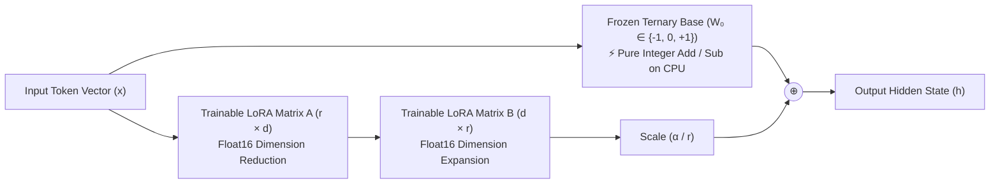
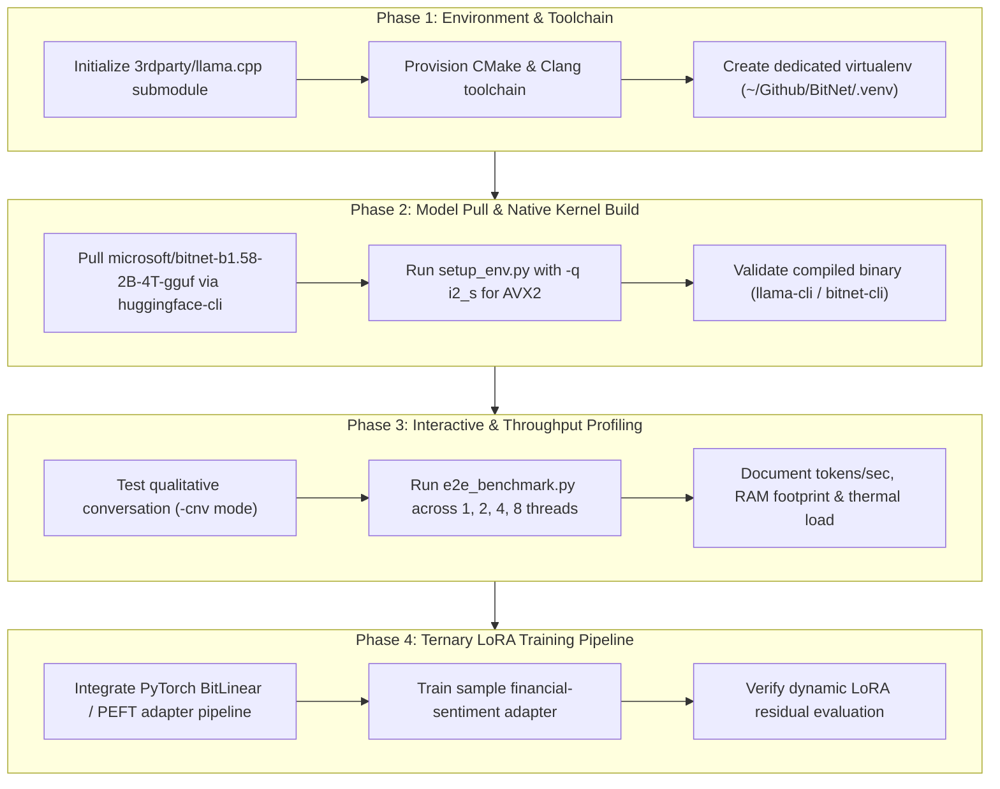

# BitNet b1.58 (2B-4T): Ternary CPU Inference & LoRA Fine-Tuning Roadmap

> **Target Model**: [`microsoft/bitnet-b1.58-2B-4T-gguf`](https://huggingface.co/microsoft/bitnet-b1.58-2B-4T-gguf) / [`microsoft/BitNet-b1.58-2B-4T`](https://huggingface.co/microsoft/BitNet-b1.58-2B-4T)  
> **Repository**: `~/Github/BitNet` (`bitnet.cpp`)  
> **Host Environment**: macOS (Darwin x86_64, Intel Core i9-9880H, 16 GB RAM, AVX2 SIMD)  
> **Primary Authority**: [`KNOWTHANKYEW_PORTFOLIO_MASTER_BRIEF.md`](https://gist.github.com/knowthankyew/53ccf4d5a81e916f895c74e18b231e16)  
> **Date**: October 3, 2026  

---

## 1. The Core Question: Can We Train a Ternary Model with LoRA?

### The Short Answer: **YES.**
Not only is it mathematically sound, but **ternary base models and LoRA are an extraordinary pairing for edge deployment.**

---

### The Mathematical Mechanics: Why LoRA Works on Ternary Weights

In standard LoRA (Low-Rank Adaptation), the forward pass of any adapted linear layer is:

$$h = W_0 \cdot x + \frac{\alpha}{r} (B \cdot A) \cdot x$$

Where:
- $W_0 \in \mathbb{R}^{d_{\text{out}} \times d_{\text{in}}}$ is the **pre-trained base model weight matrix**.
- $A \in \mathbb{R}^{r \times d_{\text{in}}}$ and $B \in \mathbb{R}^{d_{\text{out}} \times r}$ are **trainable low-rank decomposition matrices** ($r \ll d$).
- $\alpha$ and $r$ are constant scaling hyperparameters.

#### The Crucial Invariant: $W_0$ is 100% Frozen
During LoRA fine-tuning:
1. **$W_0$ never receives gradients**:
   $$\nabla_{W_0} \mathcal{L} = 0 \quad (\text{weights are never updated})$$
2. In BitNet b1.58, $W_0 \in \{-1,\; 0,\; +1\}$. **Because $W_0$ is frozen, its ternary property remains completely intact throughout training.**
3. Only the lightweight low-rank adapters $A$ and $B$ receive backpropagated gradients and are updated in standard floating-point precision (`float16` or `float32`).



---

### Two Inference Paradigms for BitNet + LoRA

Once a LoRA adapter is trained on top of BitNet, there are two distinct ways to serve it:

#### Paradigm A: Dynamic Parallel Adapter (The FTaaS Multi-Tenant Pattern)
- **How It Works**: The base model stays in memory as pure 2-bit ternary weights. When an inference request arrives, the CPU evaluates the ternary base layer using SIMD integer addition/subtraction, and in parallel runs the tiny $r=8$ or $r=16$ float adapter projection.
- **Why It's Ideal**:
  - **Zero Quality Loss**: The floating-point adapter retains continuous nuance (perfect for strict compliance tags and domain jargon).
  - **Preserves CPU Speed**: 99.5% of the model parameters remain ternary integer additions.
  - **Instant Hot-Swapping**: 100 department adapters can be swapped on a single 1.2 GB BitNet base model without reloading weights.

#### Paradigm B: Full Weight Merging (The Pure-Ternary Edge Package)
- **How It Works**: Standard LoRA merges weights by addition: $W_{\text{merged}} = W_0 + \frac{\alpha}{r} BA$. Because $BA$ is continuous float, $W_{\text{merged}}$ is no longer ternary. To restore a single standalone ternary model, the merged matrix is passed through a **Ternary Quantization-Aware re-binning function**:
  $$W_{\text{ternary\_merged}} = \text{Round}\left(\text{Clamp}\left(\frac{W_{\text{merged}}}{\gamma},\; -1,\; +1\right)\right)$$
- **Trade-Off**: Requires calibration steps to ensure the re-binning does not lose domain accuracy, but yields a standalone, zero-float ternary model.

---

## 2. Model Tier Comparison

How `BitNet-b1.58-2B-4T` compares against our existing FTaaS supported models:

| Dimension | SmolLM2-135M | Gemma 2 2B IT | BitNet b1.58 2B-4T |
| :--- | :--- | :--- | :--- |
| **Parameter Count** | ~135 Million | ~2.6 Billion | ~2.4 Billion |
| **Native Weight Format**| FP16 / BF16 | FP16 / BF16 | **Ternary $\{-1, 0, +1\}$** |
| **Physical Storage** | ~270 MB | ~5.2 GB | **~1.15 GB** (GGUF `i2_s`) |
| **Compute Primitive** | Floating-Point MAC | Floating-Point MAC | **Integer ADD / SUB (No MAC)** |
| **Min Hardware** | Any CPU / MPS / CUDA | 8GB+ VRAM or Metal | **Any Modern CPU (AVX2/NEON)** |
| **LoRA Trainability** | ✅ Native PyTorch PEFT | ✅ Native PyTorch PEFT | **✅ PyTorch BitLinear / QVAC** |
| **Training Tokens** | ~2 Trillion | ~2 Trillion | **4 Trillion** (Trained from scratch) |
| **Licensing** | Apache 2.0 | Gated (Gemma Terms) | **MIT License** (Fully Open) |

---

## 3. Four-Phase Execution Roadmap



---

### Phase 1: Environment & Build Toolchain
1. **Initialize Git Submodules**:
   `gh repo clone` does not fetch submodules by default. We must populate `~/Github/BitNet/3rdparty/llama.cpp`:
   ```bash
   cd ~/Github/BitNet
   git submodule update --init --recursive
   ```
2. **Build Tools**:
   Verify CMake and Apple Clang (`Apple clang version 21.0.0` is already installed; provision CMake via `pip install cmake` in virtualenv or `/usr/local/bin/brew install cmake`).
3. **Dedicated Python Virtual Environment**:
   Create `~/Github/BitNet/.venv` to keep dependencies isolated from the FTaaS ML workspace.

---

### Phase 2: Model Acquisition & Optimized Native Build
1. **Download Pre-Trained GGUF**:
   Acquire the official Microsoft GGUF weights:
   ```bash
   huggingface-cli download microsoft/BitNet-b1.58-2B-4T-gguf --local-dir models/BitNet-b1.58-2B-4T
   ```
2. **Compile Native AVX2 Kernels**:
   Run Microsoft's environment builder targeting the `i2_s` kernel on x86_64:
   ```bash
   python setup_env.py -md models/BitNet-b1.58-2B-4T -q i2_s
   ```
   *Technical verification*: Ensure CMake detects AVX2 support on the Intel Core i9-9880H and compiles `ggml-bitnet` without falling back to unvectorized scalar emulation.

---

### Phase 3: Qualitative Testing & CPU Throughput Benchmarking
1. **Interactive Conversational Verification**:
   Execute interactive conversational mode to evaluate response coherence and instruction compliance:
   ```bash
   python run_inference.py \
     -m models/BitNet-b1.58-2B-4T/ggml-model-i2_s.gguf \
     -p "You are an enterprise compliance assistant. Explain Regulation CC hold policies." \
     -cnv
   ```
2. **Throughput & Thread Scaling Benchmark**:
   Execute `e2e_benchmark.py` testing generation throughput (decode tokens/sec) and prompt processing speed (prefill tokens/sec) across thread counts:
   - $t=1$: Single-core baseline throughput.
   - $t=2, 4$: Scaling efficiency on performance cores.
   - $t=8$: Full hyperthreaded hardware envelope.
3. **Resource Profiling**:
   Confirm physical RAM stays bounded below **1.2 GB** and record CPU temperature impact.

---

### Phase 4: Ternary LoRA Training Pipeline (The Frontier)
1. **Model Definition**:
   Define `BitNet-b1.58-2B-4T` in `model_registry.py` with:
   - `model_id`: `microsoft/BitNet-b1.58-2B-4T`
   - `chat_template`: ChatML / Llama-3 style
   - `target_modules`: `["q_proj", "v_proj", "k_proj", "o_proj"]`
   - `min_gpu_vram_gb`: $0.0\text{ GB}$ (Native CPU executable)
2. **PyTorch Worker Integration**:
   Utilize `BitLinear` module wrappers in `trainer.py` so standard Hugging Face PEFT LoRA attaches directly to the linear projection boundaries.
3. **Live Benchmark Run**:
   Fine-tune an adapter on `datasets/sample-financial-sentiment.jsonl` using the existing FTaaS event-driven training pipeline and log loss curves and adapter size to MLflow.

---

## 4. Key Engineering Risks & Mitigations

| Risk | Cause | Mitigation Strategy |
| :--- | :--- | :--- |
| **Empty Submodule Directory** | `gh repo clone` omits submodules | Explicit `git submodule update --init --recursive` in Step 1. |
| **Missing Native CMake** | Host system lacks global CMake in `$PATH` | Install CMake into dedicated `.venv` via `pip install cmake`. |
| **macOS x86_64 Kernel Mismatch** | `setup_env.py` selecting ARM `tl1` on Intel | Force `-q i2_s` and pass `-DBITNET_X86_TL2=OFF` if targeting standard `i2_s` AVX2. |
| **PyTorch Training Weights vs GGUF** | GGUF is optimized for C++ inference, not PyTorch backprop | Use GGUF for Phase 1–3 CPU inference; use Hugging Face PyTorch weights (`microsoft/BitNet-b1.58-2B-4T`) for Phase 4 LoRA. |

---

## 5. Artifact Status & Verification

This roadmap document resides locally in the Antigravity conversation brain directory:
- **Location**: `file:///Users/cl0rkster/.gemini/antigravity/brain/6d189298-3f35-4110-91df-7ccfd49f6987/BITNET_TERNARY_LORA_ROADMAP.md`
- **Git Status**: Untracked / Isolated (no modifications made to the `ml` git repository).
