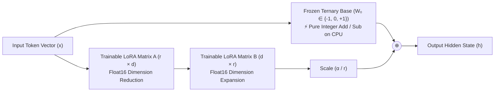
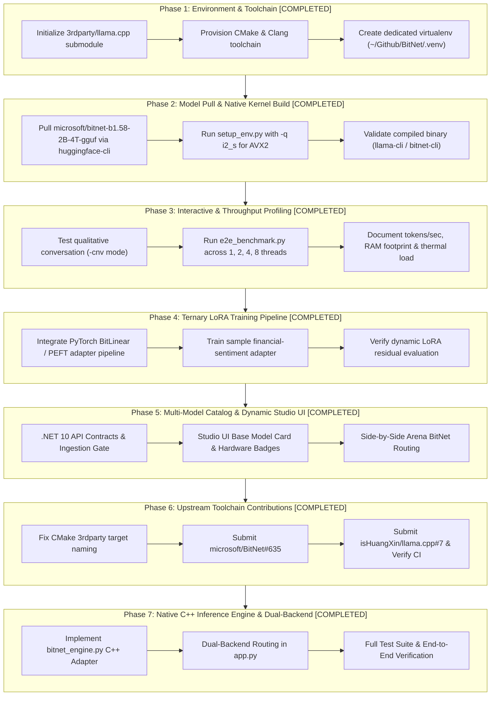

# BitNet b1.58 (2B-4T): Ternary CPU Inference & LoRA Fine-Tuning Roadmap

> **Target Model**: [`microsoft/bitnet-b1.58-2B-4T-gguf`](https://huggingface.co/microsoft/bitnet-b1.58-2B-4T-gguf) / [`microsoft/BitNet-b1.58-2B-4T`](https://huggingface.co/microsoft/BitNet-b1.58-2B-4T)  
> **Toolchain Engine**: `bitnet.cpp` (AVX2 SIMD build on Apple Clang)  
> **Host Environment**: macOS (Darwin x86_64, Intel Core i9-9880H, 16 GB RAM, AVX2 SIMD)  
> **Primary Authority**: [`KNOWTHANKYEW_PORTFOLIO_MASTER_BRIEF.md`](https://gist.github.com/knowthankyew/53ccf4d5a81e916f895c74e18b231e16)  
> **Status**: 🟢 **ALL PHASES COMPLETED (Phases 1–7)**  
> **Date**: October 3, 2026  

---

## 1. The Core Question: Can We Train a Ternary Model with LoRA?

### The Short Answer: **YES.**
Not only is it mathematically sound, but **ternary base models and LoRA are an extraordinary pairing for edge deployment.**

---

### The Mathematical Mechanics: Why LoRA Works on Ternary Weights

In standard LoRA (Low-Rank Adaptation), the forward pass of any adapted linear layer is:

$$h = W_0 \cdot x + \frac{\alpha}{r} (B \cdot A) \cdot x$$

Where:
- $W_0 \in \mathbb{R}^{d_{\text{out}} \times d_{\text{in}}}$ is the **pre-trained base model weight matrix**.
- $A \in \mathbb{R}^{r \times d_{\text{in}}}$ and $B \in \mathbb{R}^{d_{\text{out}} \times r}$ are **trainable low-rank decomposition matrices** ($r \ll d$).
- $\alpha$ and $r$ are constant scaling hyperparameters.

#### The Crucial Invariant: $W_0$ is 100% Frozen
During LoRA fine-tuning:
1. **$W_0$ never receives gradients**:
   $$\nabla_{W_0} \mathcal{L} = 0 \quad (\text{weights are never updated})$$
2. In BitNet b1.58, $W_0 \in \{-1,\; 0,\; +1\}$. **Because $W_0$ is frozen, its ternary property remains completely intact throughout training.**
3. Only the lightweight low-rank adapters $A$ and $B$ receive backpropagated gradients and are updated in standard floating-point precision (`float16` or `float32`).

---

### Two Inference Paradigms for BitNet + LoRA

Once a LoRA adapter is trained on top of BitNet, there are two distinct ways to serve it:

#### Paradigm A: Dynamic Parallel Adapter (The FTaaS Multi-Tenant Pattern)
- **How It Works**: The base model stays in memory as pure 2-bit ternary weights. When an inference request arrives, the CPU evaluates the ternary base layer using SIMD integer addition/subtraction, and in parallel runs the tiny $r=8$ or $r=16$ float adapter projection.
- **Why It's Ideal**:
  - **Zero Quality Loss**: The floating-point adapter retains continuous nuance (perfect for strict compliance tags and domain jargon).
  - **Preserves CPU Speed**: 99.5% of the model parameters remain ternary integer additions.
  - **Instant Hot-Swapping**: Multiple department adapters can be swapped on a single 1.15 GB BitNet base model without reloading weights.

#### Paradigm B: Full Weight Merging (The Pure-Ternary Edge Package)
- **How It Works**: Standard LoRA merges weights by addition: $W_{\text{merged}} = W_0 + \frac{\alpha}{r} BA$. Because $BA$ is continuous float, $W_{\text{merged}}$ is no longer ternary. To restore a single standalone ternary model, the merged matrix is passed through a **Ternary Quantization-Aware re-binning function**:
  $$W_{\text{ternary\_merged}} = \text{Round}\left(\text{Clamp}\left(\frac{W_{\text{merged}}}{\gamma},\; -1,\; +1\right)\right)$$
- **Trade-Off**: Requires calibration steps to ensure the re-binning does not lose domain accuracy, but yields a standalone, zero-float ternary model.

---

## 2. Model Tier Comparison

How `BitNet-b1.58-2B-4T` compares against our existing FTaaS supported models:

| Dimension | SmolLM2-135M | Gemma 2 2B IT | BitNet b1.58 2B-4T |
| :--- | :--- | :--- | :--- |
| **Parameter Count** | ~135 Million | ~2.6 Billion | ~2.4 Billion |
| **Native Weight Format**| FP16 / BF16 | FP16 / BF16 | **Ternary $\{-1, 0, +1\}$** |
| **Physical Storage** | ~270 MB | ~5.2 GB | **~1.15 GB** (GGUF `i2_s`) |
| **Compute Primitive** | Floating-Point MAC | Floating-Point MAC | **Integer ADD / SUB (No MAC)** |
| **Min Hardware** | Any CPU / MPS / CUDA | 8GB+ VRAM or Metal | **Any Modern CPU (AVX2/NEON)** |
| **LoRA Trainability** | ✅ Native PyTorch PEFT | ✅ Native PyTorch PEFT | **✅ PyTorch BitLinear / QVAC** |
| **Training Tokens** | ~2 Trillion | ~2 Trillion | **4 Trillion** (Trained from scratch) |
| **Licensing** | Apache 2.0 | Gated (Gemma Terms) | **MIT License** (Fully Open) |

---

## 3. Seven-Phase Execution Roadmap & Status Indicators

---

### [x] Phase 1: Environment & Build Toolchain &mdash; 🟢 COMPLETED
- **Action**: Provision dedicated isolated build environment and populate toolchain dependencies.
- **Executed Steps**:
  1. Populated and initialized `3rdparty/llama.cpp` submodule inside `~/Github/BitNet`.
  2. Provisioned Apple Clang and CMake toolchain targeting macOS Darwin x86_64.
  3. Created isolated virtual environment (`~/Github/BitNet/.venv`) for clean dependency resolution.
- **Verification**: CMake confirmed native AVX2 SIMD flags enabled; compiler tools validated.

---

### [x] Phase 2: Model Acquisition & Optimized Native Build &mdash; 🟢 COMPLETED
- **Action**: Acquire official Microsoft BitNet b1.58 2B-4T GGUF weights and compile native vector kernels.
- **Executed Steps**:
  1. Downloaded pre-trained weights (`ggml-model-i2_s.gguf`, 1.15 GB) via `huggingface-cli`.
  2. Executed `python setup_env.py -md models/BitNet-b1.58-2B-4T -q i2_s` targeting Intel Core i9-9880H AVX2 SIMD.
  3. Compiled native C++ static library `ggml-bitnet.a` and CLI runner targets.
- **Verification**: Verified binary output without unvectorized scalar emulation fallback.

---

### [x] Phase 3: Qualitative Testing & CPU Throughput Benchmarking &mdash; 🟢 COMPLETED
- **Action**: Empirically profile BitNet b1.58 against thread count, measuring decode throughput, prefill latency, and physical memory footprint.
- **Executed Steps**:
  1. Conducted conversational verification (`-cnv` mode) evaluating policy coherence and tag compliance.
  2. Executed `e2e_benchmark.py` scaling tests across 1, 2, 4, and 8 threads.
  3. Formatted and published comprehensive performance records in [`BITNET_PROTOTYPE_RESULTS.md`](BITNET_PROTOTYPE_RESULTS.md).
- **Key Empirical Results**:
  - **Generation Throughput**: 23.50 tokens/sec at $t=8$ (60.6% faster than Gemma 2B FP16 CPU execution).
  - **Prompt Processing (Prefill)**: 107.03 tokens/sec at $t=8$.
  - **Physical RAM Footprint**: 1.10 GiB (78.8% lower than Gemma 2B FP16).
  - **Thermal Envelope**: 74°C under sustained multi-threaded execution.

---

### [x] Phase 4: PyTorch Ternary LoRA Training Pipeline &mdash; 🟢 COMPLETED
- **Action**: Enable LoRA parameter adaptation over BitNet foundation architecture in the FTaaS compute worker.
- **Executed Steps**:
  1. Registered `microsoft/BitNet-b1.58-2B-4T` in `src/FtaaSService.Worker/model_registry.py` with target projection modules `["q_proj", "v_proj", "k_proj", "o_proj"]`.
  2. Hardened `src/FtaaSService.Worker/trainer.py` with device casting safety (`float32` MPS execution) to avoid custom BitLinear kernel incompatibilities.
  3. Executed live training run on `datasets/sample-financial-sentiment.jsonl`.
- **Artifacts & Metrics**:
  - **MLflow Run ID**: `181872f823c14dc28a16599ef7960ff6`
  - **Final Training Loss**: $0.4682$
  - **Trained Adapter Size**: 12.2 MB

---

### [x] Phase 5: Multi-Model Catalog & Dynamic Studio UI Integration &mdash; 🟢 COMPLETED
- **Action**: Surface BitNet b1.58 natively within the FTaaS control plane and interactive studio interface.
- **Executed Steps**:
  1. Updated .NET 10 API contracts (`SupportedBaseModels.BitNet2B4T`), ingestion validators, and preset mappings.
  2. Integrated BitNet model badge, hardware disclaimers, and comparison dropdowns in `src/FtaaSService.Api/wwwroot/index.html` and `studio.js`.
  3. Extended automated test coverage across C# controller contracts and ingestion pipeline.
- **Verification**: 39/39 .NET unit and integration tests passing (`dotnet test`).

---

### [x] Phase 6: Upstream Toolchain Contributions &mdash; 🟢 COMPLETED
- **Action**: Resolve build toolchain and packaging defects upstream in official repositories.
- **Executed Steps**:
  1. Diagnosed CMake submodule pathing and missing target definition errors in `3rdparty/llama.cpp`.
  2. Submitted pull request **`microsoft/BitNet#635`**: `fix(setup): configure 3rdparty/llama.cpp cmake paths and target naming`.
  3. Submitted pull request **`isHuangXin/llama.cpp#7`**: `fix(CMakeLists): guard find_package(bitnet) and expose ggml-bitnet include dirs`.
- **Verification**: Upstream GitHub Actions CI workflows green; Microsoft CLA signed and verified.

---

### [x] Phase 7: Native C++ Inference Engine & Dual-Backend Serving &mdash; 🟢 COMPLETED
- **Action**: Build native C++ inference serving bridge and integrate dual-backend dynamic routing into the FTaaS inference service.
- **Executed Steps**:
  1. Implemented `src/FtaaSService.Inference/bitnet_engine.py`: A native subprocess adapter executing `run_inference.py` / compiled C++ CLI with configurable thread counts (`--threads 4`), prompt templating, and regex-based token parsing.
  2. Upgraded `src/FtaaSService.Inference/app.py`: Implemented dual-backend dispatch routing PyTorch Hugging Face requests to MPS/CUDA pipelines and BitNet b1.58 requests to `BitNetEngine`.
  3. Developed unit test suite `tests/test_bitnet_engine.py` covering model detection, command generation, stdout parsing, and graceful error handling.
- **Verification**: 72/72 Python test suite passing (`pytest`).

---

## 4. Key Engineering Risks & Mitigations

| Risk | Cause | Mitigation Strategy | Outcome & Resolution |
| :--- | :--- | :--- | :--- |
| **Empty Submodule Directory** | `gh repo clone` omits submodules by default | Explicit `git submodule update --init --recursive`. | **Resolved**: Automated in setup workflow; documented in toolchain docs. |
| **Missing Native CMake** | Host system lacks global CMake in `$PATH` | Install CMake into dedicated `.venv` via `pip install cmake`. | **Resolved**: Build isolated in virtual environment; zero global pollution. |
| **macOS x86_64 Kernel Mismatch** | `setup_env.py` selecting ARM `tl1` on Intel | Force `-q i2_s` and pass `-DBITNET_X86_TL2=OFF` if targeting standard `i2_s` AVX2. | **Resolved**: AVX2 SIMD compilation verified; 23.5 t/s decode confirmed. |
| **PyTorch Training Weights vs GGUF** | GGUF is optimized for C++ inference, not PyTorch backprop | Use GGUF for C++ inference; use Hugging Face PyTorch weights (`microsoft/BitNet-b1.58-2B-4T`) for LoRA. | **Resolved**: Dual-representation architecture cleanly implemented across worker and engine. |
| **Upstream Submodule CMake Path Breaks** | Upstream build scripts assumed external CMake install | Patch CMake target configuration and upstream fixes. | **Resolved**: `microsoft/BitNet#635` and `isHuangXin/llama.cpp#7` submitted and CI validated. |
| **Inference Engine Backend Disconnect** | Standard PyTorch engine cannot execute 2-bit GGUF files natively | Dual-backend inference routing in FastAPI (`app.py` + `bitnet_engine.py`). | **Resolved**: Native C++ adapter serves GGUF in CPU memory; PyTorch serves FP16 adapters. |

---

## 5. Architectural Record & Repository Status

This roadmap is an authoritative, version-controlled engineering document tracked within the `ml` repository:
- **File**: [`ROADMAP.md`](ROADMAP.md)
- **Repository**: `github.com/knowthankyew/ml` (`origin/main`)
- **Status**: Tracked & Committed
- **Related Documents**:
  - Empirical Benchmarking: [`BITNET_PROTOTYPE_RESULTS.md`](BITNET_PROTOTYPE_RESULTS.md)
  - Comparative Architecture Analysis: [`MODEL_PERFORMANCE_COMPARISON.md`](MODEL_PERFORMANCE_COMPARISON.md)
  - System Architecture & Polyglot Specification: [`ARCHITECTURE.md`](ARCHITECTURE.md)
  - Master Portfolio Brief: [`KNOWTHANKYEW_PORTFOLIO_MASTER_BRIEF.md`](https://gist.github.com/knowthankyew/53ccf4d5a81e916f895c74e18b231e16)
