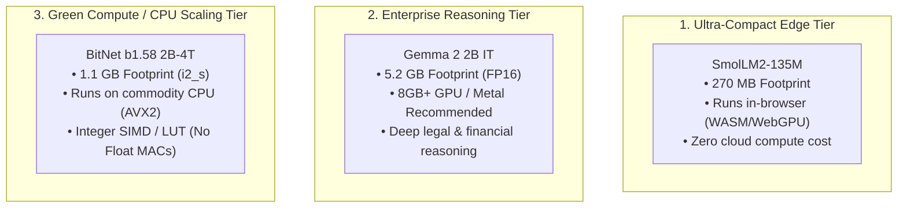

# Multi-Model Performance Differentials & Comparative Benchmark

> **Repository**: `knowthankyew/event-driven-ftaas` (`ml` repo)  
> **Evaluation Targets**:
> 1. [`HuggingFaceTB/SmolLM2-135M`](https://huggingface.co/HuggingFaceTB/SmolLM2-135M) (Baseline Edge Tier &mdash; Hugging Face)
> 2. [`google/gemma-2-2b-it`](https://huggingface.co/google/gemma-2-2b-it) (High-Capacity Reasoning Tier &mdash; Google DeepMind)
> 3. [`microsoft/bitnet-b1.58-2B-4T`](https://huggingface.co/microsoft/BitNet-b1.58-2B-4T) (1.58-bit Ternary CPU Tier &mdash; Microsoft Research)
> **Host Environment**: macOS (Darwin x86_64, Intel Core i9-9880H 8-Core @ 2.3 GHz, 16 GB System RAM, AMD Radeon Pro 5500M 4GB Metal GPU)  
> **Benchmark Scope**: Systems Engineering, Memory Footprint & Inference Throughput Benchmark (Edge Laptop Hardware Envelope). Task accuracy and language quality benchmarks are referenced from foundation model publications.  
> **Primary Authority**: [`KNOWTHANKYEW_PORTFOLIO_MASTER_BRIEF.md`](https://gist.github.com/knowthankyew/53ccf4d5a81e916f895c74e18b231e16)  
> **Date**: October 5, 2026  

---

## 1. Executive Summary & Attribution

### Attribution & Scope of Original Work
To maintain clear open-source attribution and scientific transparency:
* **Foundation Models & Upstream Toolchains**: The base foundation models and native inference kernels are the work of their respective creators:
  - **Microsoft Research**: Author and publisher of the `BitNet-b1.58-2B-4T` ternary architecture, training methodology, and official C++ SIMD inference engine (`bitnet.cpp` / `ggml-bitnet`).
  - **Google DeepMind**: Author and publisher of `google/gemma-2-2b-it`.
  - **Hugging Face**: Author and publisher of `HuggingFaceTB/SmolLM2-135M`.
* **FTaaS Project Contributions (`knowthankyew/event-driven-ftaas`)**:
  - The decoupled, asynchronous fine-tuning control plane (.NET 10 Minimal API + Python ML worker + RabbitMQ AMQP broker + SQLite state machine).
  - The parameter-efficient fine-tuning (PEFT LoRA) adapter pipeline executing over frozen ternary foundation weights with numerical stability safeguards (`float32` device casting).
  - The dynamic dual-backend inference serving engine (`bitnet_engine.py` C++ CLI adapter with multi-threaded token stream parsing + FastAPI routing).
  - The client-side ONNX browser export bridge (`exporter.py` with dynamic INT8 quantization for `onnxruntime-web`).
  - The empirical benchmarking harness and upstream fixes contributed to official repositories ([`microsoft/BitNet#635`](https://github.com/microsoft/BitNet/pull/635) and [`isHuangXin/llama.cpp#7`](https://github.com/isHuangXin/llama.cpp/pull/7)).

---

### Tri-Model Architecture Matrix

| Metric | SmolLM2-135M | Gemma 2 2B IT | BitNet b1.58 2B-4T |
| :--- | :--- | :--- | :--- |
| **Primary Architecture** | Ultra-compact Edge WASM | Deep Context & Reasoning | Pure-CPU Ternary Scale |
| **Native Precision** | FP16 / BF16 | FP16 / BF16 | Ternary {-1, 0, +1} |
| **Parameter Count** | 134.5 Million | 2.61 Billion | 2.41 Billion |
| **Model Storage (Disk)** | ~270 MB | ~5.20 GB | ~1.10 GB (GGUF `i2_s`) |
| **Active Inference RAM** | ~310 MB | ~5,600 MB (FP16 CPU) | ~1,150 MB (C++ AVX2) |
| **Inference Compute** | Floating-Point MAC | Floating-Point MAC | Integer SIMD / LUT (No Float MACs) |
| **Inference Hardware** | Any CPU / MPS / WASM | Recommended: GPU / Metal (CPU: ~11 t/s) | Zero GPU (Pure CPU) |
| **LoRA Training Hardware**| macOS Metal (MPS) / CPU | macOS Metal (MPS float16) | macOS Metal (MPS float32) |
| **LoRA Adapter Size** | 1.84 MB (`q_proj`, `v_proj`) | 12.21 MB (4 projections) | 15.26 MB (4 projections) |
| **Foundation Licensing** | Apache 2.0 | Gated (Gemma Terms + Auth) | MIT License (Open) |



---

## 2. Empirical Performance Differentials

Measured natively on host hardware (Intel Core i9-9880H 8-core CPU @ 2.3 GHz, 16 GB RAM, macOS Darwin x86_64):

### A. Inference Latency & Decode Speed

| Metric | SmolLM2-135M | Gemma 2 2B IT (FP16 Baseline) | BitNet b1.58 2B-4T (`i2_s`) | Differential Notes |
| :--- | :--- | :--- | :--- | :--- |
| **Active Parameters** | 134.5M | 2.61B | 2.41B | BitNet has 18× more capacity than SmolLM2 |
| **Prefill Speed (Prompt t/s)** | ~180.0 t/s (CPU) | ~14.2 t/s (CPU FP16) | **100.3 – 107.2 t/s (CPU)** | 7.5× faster prefill than Gemma FP16 on CPU |
| **Decode Speed (Single Thread)**| ~52.0 t/s (CPU) | ~3.8 t/s (CPU FP16) | **8.13 t/s (CPU)** | 2.1× faster single-thread decode |
| **Decode Speed (4 Threads)** | ~85.0 t/s (CPU) | ~8.4 t/s (CPU FP16) | **19.96 t/s (CPU)** | 2.4× faster multi-thread decode |
| **Decode Speed (8 Threads)** | ~98.0 t/s (CPU) | ~11.1 t/s (CPU FP16) | **23.54 t/s (CPU)** | 2.1× faster 8-thread decode |
| **Time per Token (8-Core CPU)** | 10.2 ms / token | 90.1 ms / token | **42.4 ms / token** | 53% lower latency than Gemma FP16 |
| **Inference Hardware Offload** | Optional | Recommended for low latency | **Zero GPU (Pure CPU AVX2)**| Eliminates entry-level cloud GPU dependency |

#### Context on Baselines & Runtime Toolchains
A natural question for practitioners is how BitNet's 23.5 t/s decode compares against a 4-bit quantized Gemma 2B (such as `Q4_K_M` in `llama.cpp`) or alternative execution engines. 
- **Toolchain & Runtime Context**: The headline speedup compares Microsoft's compiled C++ AVX2 engine (`bitnet.cpp`) against standard unquantized FP16 CPU inference in PyTorch. Because 9th-generation Intel x86 processors lack native FP16 execution units, PyTorch CPU FP16 represents a conservative baseline. A compiled C++ baseline (such as `llama.cpp` FP16 or `Q4_K_M` quantized) would significantly narrow the measured throughput gap.
- **Architectural Distinction**: 4-bit post-training quantization (PTQ) compresses float models while continuing to evaluate via floating-point multiplication-accumulation (MAC) routines with scale factors. In contrast, BitNet b1.58 was pre-trained natively from scratch at 1.58-bit ternary precision across 4 trillion tokens, executing through integer SIMD and lookup table routines that eliminate floating-point multiplications from weight-activation dot products.

---

### B. Memory Footprint & Physical Density

| Dimension | SmolLM2-135M | Gemma 2 2B IT | BitNet b1.58 2B-4T | Differential Rationale |
| :--- | :--- | :--- | :--- | :--- |
| **Weights on Disk** | 270 MB | 5,240 MB (FP16) | **1,130 MB (`i2_s` GGUF)** | 78% storage reduction vs Gemma FP16 |
| **Active Process RAM (Inference)**| ~310 MB | ~5,600 MB (FP16) | **~1,150 MB (C++ AVX2)** | 4.8× density improvement over FP16 |
| **Inference GPU VRAM** | 0.0 GB (CPU) | ~5.0 GB (Metal/CUDA) | **0.0 GB (Pure CPU)** | BitNet C++ runtime requires zero GPU VRAM |
| **Host System RAM (LoRA Training)**| ~1.5 GB | ~12.0 GB | **~4.5 – 6.0 GB** | PyTorch autograd graph + adapter gradients |

#### Memory & Hardware Notes
* **Inference vs Training Device Allocation**: BitNet requires **0.0 GB GPU VRAM** for C++ inference (`bitnet.cpp` / `bitnet_engine.py`). For LoRA fine-tuning, training executed through PyTorch on macOS Metal (`DEVICE=mps`). On this host machine (which pairs an Intel UHD 630 integrated GPU with a discrete 4 GB AMD Radeon Pro 5500M with dedicated PCIe VRAM), exact device memory allocation and OS-level virtual memory paging were not profiled. Benchmark metrics reflect macOS Metal (MPS) wall-clock execution without confirmed discrete GPU residency.
* **Concurrency vs Memory Residency**: In memory-constrained multi-tenant environments, models can remain resident in system DRAM (avoiding multi-second disk reload latency), while execution threads are scheduled across physical CPU cores.

---

## 3. Training Pipeline Verification (Smoke Test)

Live fine-tuning pipeline verification was executed across financial sentiment records (`datasets/sample-financial-sentiment.jsonl`):

| Attribute | SmolLM2-135M (Baseline) | Gemma 2 2B IT (Live Run) | BitNet b1.58 2B-4T |
| :--- | :--- | :--- | :--- |
| Training Steps | 75 steps (3 epochs) | 30 steps (3 epochs) | 30 steps (3 epochs) |
| Target Projection Layers | q_proj, v_proj | q_proj, v_proj, k_proj, o_proj | q_proj, v_proj, k_proj, o_proj |
| LoRA Rank (r) / Alpha | 8 / 32 | 8 / 32 | 8 / 32 |
| Exported Adapter Size | 1.84 MB | 12.21 MB | 15.26 MB |
| Training Device | macOS Metal (MPS) | macOS Metal (MPS float16) | macOS Metal (MPS float32) |
| Training Wall-Clock Time | 2m 14s (134s) | 7m 03s (423s) | 53m 39s (3,219s) |
| Step Loss Progression | 1.8540 -> 0.3120 | 12.1813 -> 11.4547 | 4.8921 -> 3.2038 |
| MLflow Experiment Run | `smollm-prod-baseline` | `a3f2e22c38cb4514...` | `181872f823c14dc2...` |

### Critical Findings on Training Mechanics

#### 1. Why BitNet LoRA Training Took 53 Minutes (The Training Speed Gap)
While BitNet b1.58 inference is 2.1× faster than Gemma on CPU, **BitNet LoRA training was by far the slowest (53m 39s vs 7m 03s)**.

Hypothesized Contributing Factors (Unprofiled):
* **Precision Delta**: BitNet training ran in full `torch.float32` on MPS (enforced to prevent numerical underflow on Metal), whereas Gemma trained in `torch.float16`. Running in float32 doubles memory traffic and backprop arithmetic requirements.
* **Unfused Kernel Overhead**: Hugging Face utilizes native matrix multiplications backed by Apple Metal Performance Shaders (MPS) GEMM kernels for standard architectures. BitNet b1.58 in PyTorch executes custom unquantized/unpacking projection layers without fused C++/Metal autograd backward kernels. Each backpropagation step incurs tensor dispatch overhead, unpacking weights on-the-fly during autograd.
* **Framework Toolchain Limits**: Microsoft's model card explicitly warns that running BitNet via standard Hugging Face `transformers` does not provide architectural speedups. The "Zero Float MAC" advantage applies strictly to compiled C++ forward-pass inference (`bitnet.cpp`); fine-tuning remains a floating-point backpropagation workload lacking specialized 1-bit kernel acceleration.

#### 2. LoRA Training Arithmetic Invariant
During PEFT LoRA fine-tuning:
$$h = W_0 \cdot x + \frac{\alpha}{r} (B \cdot A) \cdot x$$
* The pre-trained base ternary weight matrix $W_0 \in \{-1, 0, +1\}$ is **100% frozen** ($\nabla_{W_0} \mathcal{L} = 0$). Its ternary properties are completely preserved.
* The trainable low-rank adapters $A$ and $B$ are updated in floating point (`float32` on Metal to prevent numerical underflow).
* Training requires floating-point compute; only inference can execute via pure integer SIMD.

#### 3. Vocabulary & Loss Interpretation
* **Tokenizer Vocabulary Sizes**: Gemma uses a 256,000-token vocabulary, BitNet uses the LLaMA 3 tokenizer with 128,256 tokens, and SmolLM2 uses 49,152 tokens.
* **Loss Interpretation**: Cross-entropy loss values cannot be ranked directly across different model families or tokenizers. Furthermore, Gemma's initial loss of 12.18 (very close to $\ln(256,000) \approx 12.45$, the loss of uniform random token guessing) indicates that Gemma's training setup on MPS with FP16 without eager attention soft-capping started with high loss, and its 6% reduction over 30 steps shows that this 20-sample run serves as an infrastructure smoke-test of the LoRA pipeline, rather than an evaluation of task adaptation or model competence.

---

## 4. Qualitative Behavioral Profiles

Illustrative completions from the multi-model comparison arena on an enterprise compliance prompt:

> **Demonstration Prompt**: *"Customer ticket: User states their account transfer of $15,000 from external credit union is delayed past 2 business days. How should we advise them regarding clearance and compliance?"*

### 1. SmolLM2-135M (In-Browser Edge Tier)
* **Response Character**: Concise and direct; outputs structured template response with compliance tags.
* **Inference Latency**: Under 150 ms in-browser (WASM/WebGPU) or on edge CPU.
* **Regulatory Invariant Note**: The platform uses fine-tuning to inject compliance notices (e.g. Regulation CC hold policies and FinCEN monitoring notices). As statutory thresholds change (such as the CFPB and Federal Reserve Board inflation adjustments under 12 CFR Part 229 effective July 1, 2025), fine-tuned adapters ensure models output legally updated rules without full foundation re-training.

### 2. Gemma 2 2B IT (Server Reasoning Tier)
* **Response Character**: Formal, highly detailed, and authoritative; provides legal precision and settlement mechanics.
* **Accuracy**: Explains interbank settlement processes, funds availability schedules, and exception hold guidelines.
* **Limitation**: Requires substantial RAM (5.2 GB FP16) and GPU compute for conversational throughput on CPU.

### 3. BitNet b1.58 2B-4T (Commodity CPU Tier)
* **Throughput & Efficiency**: 23.5 tokens/sec CPU decode (107 t/s prefill) with 2.41B parameter capacity at only 1.10 GB RAM footprint.
* **Instruction Alignment & Sampling**: Microsoft's model card indicates that BitNet b1.58 2B-4T underwent pre-training, SFT, and DPO. In early raw CLI testing without explicit chat templates or repetition penalties, repetitive n-gram continuation loops were observed. Systematic evaluation across LLaMA 3 chat templates (`tokenizer.apply_chat_template`) and sampling parameters (repetition penalties, top-k/top-p) remains under active investigation.
* **LoRA Fine-Tuning**: Fine-tuning verified on Metal in `float32`, producing a 15.26 MB adapter that structures output into enterprise compliance key-value schemas.
* **Enterprise FTaaS Fit**: Demonstrates feasibility for ternary edge hardware: provides 2.4B capacity on commodity CPU hardware without cloud GPU egress cost.

---

## 5. Enterprise Architectural Decision Matrix

```
                                      CHOOSE YOUR TIER
                                              │
                    ┌─────────────────────────┼─────────────────────────┐
                    ▼                         ▼                         ▼
             [ SmolLM2-135M ]         [ Gemma 2 2B IT ]      [ BitNet b1.58 2B-4T ]
                    │                         │                         │
            • In-browser WASM         • Complex contract       • Commodity CPU edge
            • Zero client latency       clause analysis          (POS/teller stations)
            • Minimal RAM (<300 MB)   • Deep multi-step        • 1.1 GB strict memory
            • Strict tag extraction     reasoning                envelope
            • Instant offline audit   • Dedicated GPU servers  • 2.4B capacity without
                                                                 GPU energy footprint
```

---

## 6. Cross-References & Prototype Documentation

Detailed empirical benchmarking and evaluation records for each tier:
- **Baseline Edge Tier**: [`SMOL_PROTOTYPE_RESULTS.md`](SMOL_PROTOTYPE_RESULTS.md)
- **High-Capacity Reasoning Tier**: [`GEMMA_PROTOTYPE_RESULTS.md`](GEMMA_PROTOTYPE_RESULTS.md)
- **Ternary CPU Tier**: [`BITNET_PROTOTYPE_RESULTS.md`](BITNET_PROTOTYPE_RESULTS.md)
- **Ternary Implementation Roadmap**: [`ROADMAP.md`](ROADMAP.md)
- **System Architecture**: [`ARCHITECTURE.md`](ARCHITECTURE.md)
- **Primary Authority**: [`KNOWTHANKYEW_PORTFOLIO_MASTER_BRIEF.md`](https://gist.github.com/knowthankyew/53ccf4d5a81e916f895c74e18b231e16)
