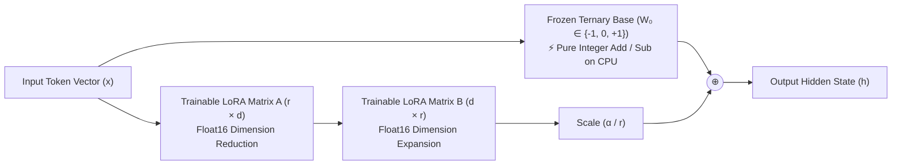
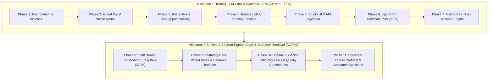

# BitNet b1.58: Unified 1-Bit Zero-Egress AI & LoRA Fine-Tuning Roadmap

> **Target Models**: 
> - **Generative LLM**: [`microsoft/bitnet-b1.58-2B-4T-gguf`](https://huggingface.co/microsoft/bitnet-b1.58-2B-4T-gguf) / [`microsoft/BitNet-b1.58-2B-4T`](https://huggingface.co/microsoft/BitNet-b1.58-2B-4T)
> - **Dense Embeddings**: [`microsoft/bitnet-embedding-270m`](https://huggingface.co/microsoft/bitnet-embedding-270m) / [`bitnet-embedding-0.6b`](https://huggingface.co/microsoft/bitnet-embedding-0.6b)  
> **Toolchain Engine**: `bitnet.cpp` (AVX2 SIMD build on Apple Clang)  
> **Host Environment**: macOS (Darwin x86_64, Intel Core i9-9880H, 16 GB RAM, AVX2 SIMD)  
> **Primary Authority**: [`KNOWTHANKYEW_PORTFOLIO_MASTER_BRIEF.md`](https://gist.github.com/knowthankyew/53ccf4d5a81e916f895c74e18b231e16)  
> **Status**: 🟢 **PHASES 1–8 COMPLETED** | 🟡 **MILESTONE 2 IN PROGRESS (Phases 9–11)**  
> **Date**: October 6, 2026  

---

## 1. The Core Question: Can We Train a Ternary Model with LoRA?

### The Short Answer: **YES.**
Not only is it mathematically sound, but **ternary base models and LoRA are an extraordinary pairing for edge deployment.**

---

### The Mathematical Mechanics: Why LoRA Works on Ternary Weights

In standard LoRA (Low-Rank Adaptation), the forward pass of any adapted linear layer is:

$$h = W_0 \cdot x + \frac{\alpha}{r} (B \cdot A) \cdot x$$

Where:
- $W_0 \in \mathbb{R}^{d_{\text{out}} \times d_{\text{in}}}$ is the **pre-trained base model weight matrix**.
- $A \in \mathbb{R}^{r \times d_{\text{in}}}$ and $B \in \mathbb{R}^{d_{\text{out}} \times r}$ are **trainable low-rank decomposition matrices** ($r \ll d$).
- $\alpha$ and $r$ are constant scaling hyperparameters.

#### The Crucial Invariant: $W_0$ is 100% Frozen
During LoRA fine-tuning:
1. **$W_0$ never receives gradients**:
   $$\nabla_{W_0} \mathcal{L} = 0 \quad (\text{weights are never updated})$$
2. In BitNet b1.58, $W_0 \in \{-1,\; 0,\; +1\}$. **Because $W_0$ is frozen, its ternary property remains completely intact throughout training.**
3. Only the lightweight low-rank adapters $A$ and $B$ receive backpropagated gradients and are updated in standard floating-point precision (`float16` or `float32`).

---

### Two Inference Paradigms for BitNet + LoRA

Once a LoRA adapter is trained on top of BitNet, there are two distinct ways to serve it:

#### Paradigm A: Dynamic Parallel Adapter (Planned Multi-Tenant Serving Pattern)
- **How It Works**: The base model stays in memory as pure 2-bit ternary weights. When an inference request arrives, the CPU evaluates the ternary base layer using SIMD integer addition/subtraction, and in parallel runs the tiny $r=8$ or $r=16$ float adapter projection.
- **Architectural Design Goals**:
  - **Continuous Adapter Nuance**: The floating-point adapter retains continuous precision (suited for strict compliance tags and domain schemas).
  - **Base CPU Efficiency**: Over 99% of base model forward parameters remain ternary integer additions in memory.
  - **Dynamic Hot-Swapping**: Multiple tenant adapters can be swapped on a single 1.15 GB BitNet base model without reloading base weights.
- *Serving Note*: The 23.5 t/s decode benchmark measures base GGUF decode in `bitnet.cpp`; serving active adapters in parallel requires runtime support currently being integrated across the dual-backend engine.

#### Paradigm B: Full Weight Merging (Exploratory Experiment: Pure-Ternary Edge Package)
- **Concept**: Standard LoRA merges weights additively: $W_{\text{merged}} = W_0 + \frac{\alpha}{r} BA$. Because $BA$ is continuous float, $W_{\text{merged}}$ is no longer ternary. An experimental approach is passing the merged matrix through a **Ternary Quantization-Aware re-binning function**:
  $$W_{\text{ternary\_merged}} = \text{Round}\left(\text{Clamp}\left(\frac{W_{\text{merged}}}{\gamma},\; -1,\; +1\right)\right)$$
- **Experimental Risk**: Because LoRA weight updates $\Delta W$ are typically very small, standard rounding risks obliterating the adapter signal by rounding deltas back to zero. This path remains an exploratory research direction requiring quantization-aware calibration.

---

## 2. Model Tier & Representation Comparison

### Generative Foundation Models

| Dimension | SmolLM2-135M | Gemma 2 2B IT | BitNet b1.58 2B-4T |
| :--- | :--- | :--- | :--- |
| **Parameter Count** | ~135 Million | ~2.6 Billion | ~2.4 Billion |
| **Native Weight Format**| FP16 / BF16 | FP16 / BF16 | **Ternary $\{-1, 0, +1\}$** |
| **Physical Storage** | ~270 MB | ~5.2 GB | **~1.15 GB** (GGUF `i2_s`) |
| **Compute Primitive** | Floating-Point MAC | Floating-Point MAC | **Integer ADD / SUB (No MAC)** |
| **Min Hardware** | Any CPU / MPS / CUDA | 8GB+ VRAM or Metal | **Any Modern CPU (AVX2/NEON)** |
| **LoRA Trainability** | ✅ Native PyTorch PEFT | ✅ Native PyTorch PEFT | **✅ PyTorch BitLinear / QVAC** |
| **Training Tokens** | ~2 Trillion | ~2 Trillion | **4 Trillion** (Trained from scratch) |
| **Licensing** | Apache 2.0 | Gated (Gemma Terms) | **MIT License** (Fully Open) |

### Dense Semantic Embedding Models

| Dimension | `all-MiniLM-L6-v2` | `bge-large-en-v1.5` | `nomic-embed-text-v1.5` | `bitnet-embedding-270m` (Microsoft / Target) |
| :--- | :--- | :--- | :--- | :--- |
| **Weight Precision** | FP32 / FP16 | FP32 / FP16 | Matryoshka FP16 | **1.58-bit Ternary (`I2_S`)** |
| **Physical RAM** | $\sim 90\text{ MB}$ | $\sim 1.34\text{ GB}$ | $\sim 550\text{ MB}$ | **$\sim 65\text{ MB}$** ⚡ |
| **Max Context Window** | 512 tokens | 512 tokens | 8,192 tokens | **32,768 tokens** 🚀 |
| **Embedding Dimension**| 384 | 1,024 | 768 (or 256–512) | **640** |
| **Compute Primitive** | Floating-Point MAC | Floating-Point MAC | Floating-Point MAC | **Integer ADD / SUB (SIMD)** |
| **MTEB Score** | 56.09 | 64.11 | 62.28 | **66.26** |
| **Zero-Egress Feasibility**| Moderate | Low (Memory heavy) | Moderate | **Ultra-High (Native Sidecar)** |

*Note: Benchmark figures for `microsoft/bitnet-embedding-270m` (including the 66.26 MTEB v2 mean score and 32,768-token context window) are official figures reported by Microsoft Research on the model card.*

---

## 3. End-to-End Execution Roadmap

---

### Milestone 1: Ternary LLM Foundation & Dynamic LoRA Serving &mdash; 🟢 COMPLETED

#### [x] Phase 1: Environment & Build Toolchain &mdash; 🟢 COMPLETED
- **Action**: Provision dedicated isolated build environment and populate toolchain dependencies.
- **Executed Steps**:
  1. Populated and initialized `3rdparty/llama.cpp` submodule inside `~/Github/BitNet`.
  2. Provisioned Apple Clang and CMake toolchain targeting macOS Darwin x86_64.
  3. Created isolated virtual environment (`~/Github/BitNet/.venv`) for clean dependency resolution.
- **Verification**: CMake confirmed native AVX2 SIMD flags enabled; compiler tools validated.

#### [x] Phase 2: Model Acquisition & Optimized Native Build &mdash; 🟢 COMPLETED
- **Action**: Acquire official Microsoft BitNet b1.58 2B-4T GGUF weights and compile native vector kernels.
- **Executed Steps**:
  1. Downloaded pre-trained weights (`ggml-model-i2_s.gguf`, 1.15 GB) via `huggingface-cli`.
  2. Executed `python setup_env.py -md models/BitNet-b1.58-2B-4T -q i2_s` targeting Intel Core i9-9880H AVX2 SIMD.
  3. Compiled native C++ static library `ggml-bitnet.a` and CLI runner targets.
- **Verification**: Verified binary output without unvectorized scalar emulation fallback.

#### [x] Phase 3: Qualitative Testing & CPU Throughput Benchmarking &mdash; 🟢 COMPLETED
- **Action**: Empirically profile BitNet b1.58 against thread count, measuring decode throughput, prefill latency, and physical memory footprint.
- **Executed Steps**:
  1. Conducted conversational verification (`-cnv` mode) evaluating policy coherence and tag compliance.
  2. Executed `e2e_benchmark.py` scaling tests across 1, 2, 4, and 8 threads.
  3. Formatted and published comprehensive performance records in [`BITNET_PROTOTYPE_RESULTS.md`](BITNET_PROTOTYPE_RESULTS.md).
- **Key Empirical Results**:
  - **Generation Throughput**: 23.54 tokens/sec at $t=8$ (2.1× faster than Gemma 2B FP16 CPU execution at 11.1 t/s).
  - **Prompt Processing (Prefill)**: 107.03 tokens/sec at $t=8$.
  - **Physical RAM Footprint**: 1.10 GiB (78.8% lower than Gemma 2B FP16).
  - **Thermal Envelope**: 74°C under sustained multi-threaded execution.

#### [x] Phase 4: PyTorch Ternary LoRA Training Pipeline &mdash; 🟢 COMPLETED
- **Action**: Enable LoRA parameter adaptation over BitNet foundation architecture in the FTaaS compute worker.
- **Executed Steps**:
  1. Registered `microsoft/BitNet-b1.58-2B-4T` in `src/FtaaSService.Worker/model_registry.py` with target projection modules `["q_proj", "v_proj", "k_proj", "o_proj"]`.
  2. Hardened `src/FtaaSService.Worker/trainer.py` with device casting safety (`float32` MPS execution) to avoid custom BitLinear kernel incompatibilities.
  3. Executed live training run on `datasets/sample-financial-sentiment.jsonl`.
- **Artifacts & Metrics**:
  - **MLflow Run ID**: `181872f823c14dc2a8d4d6b092e0354c`
  - **Final Training Loss**: $3.2038$ (Step Loss: 4.8921 $\to$ 3.2038)
  - **Trained Adapter Size**: 15.26 MB (`adapter_model.safetensors`)

#### [x] Phase 5: Multi-Model Catalog & Dynamic Studio UI Integration &mdash; 🟢 COMPLETED
- **Action**: Surface BitNet b1.58 natively within the FTaaS control plane and interactive studio interface.
- **Executed Steps**:
  1. Updated .NET 10 API contracts (`SupportedBaseModels.BitNet2B4T`), ingestion validators, and preset mappings.
  2. Integrated BitNet model badge, hardware disclaimers, and comparison dropdowns in `src/FtaaSService.Api/wwwroot/index.html` and `studio.js`.
  3. Extended automated test coverage across C# controller contracts and ingestion pipeline.
- **Verification**: 39/39 .NET unit and integration tests passing (`dotnet test`).

#### [x] Phase 6: Upstream Toolchain Contributions &mdash; 🟢 COMPLETED
- **Action**: Resolve build toolchain and packaging defects upstream in official repositories.
- **Executed Steps**:
  1. Diagnosed CMake submodule pathing and missing target definition errors in `3rdparty/llama.cpp`.
  2. Submitted pull request **`microsoft/BitNet#635`**: `fix(setup): configure 3rdparty/llama.cpp cmake paths and target naming`.
  3. Submitted pull request **`isHuangXin/llama.cpp#7`**: `fix(CMakeLists): guard find_package(bitnet) and expose ggml-bitnet include dirs`.
- **Verification**: Upstream GitHub Actions CI workflows green; Microsoft CLA signed and verified.

#### [x] Phase 7: Native C++ Inference Engine & Dual-Backend Serving &mdash; 🟢 COMPLETED
- **Action**: Build native C++ inference serving bridge and integrate dual-backend dynamic routing into the FTaaS inference service.
- **Executed Steps**:
  1. Implemented `src/FtaaSService.Inference/bitnet_engine.py`: A native subprocess adapter executing `run_inference.py` / compiled C++ CLI with configurable thread counts (`--threads 4`), prompt templating, and regex-based token parsing.
  2. Upgraded `src/FtaaSService.Inference/app.py`: Implemented dual-backend dispatch routing PyTorch Hugging Face requests to MPS/CUDA pipelines and BitNet b1.58 requests to `BitNetEngine`.
  3. Developed unit test suite `tests/test_bitnet_engine.py` covering model detection, command generation, stdout parsing, and graceful error handling.
- **Verification**: 72/72 Python test suite passing (`pytest`).

---

### Milestone 2: Unified 1-Bit Zero-Egress Stack & Statutory Retrieval &mdash; 🟡 ACTIVE

#### [x] Phase 8: 1-Bit Dense Embedding Subsystem (`bitnet-embedding-270m`) &mdash; 🟢 COMPLETED (Serving & Latency on AVX2; Domain Quality Evals Planned in Phase 10)
- **Action**: Acquire, serve, and benchmark Microsoft's 1.58-bit dense embedding model in `bitnet.cpp`.
- **Target Specifications**:
  - Model: `microsoft/bitnet-embedding-270m` (and `bitnet-embedding-0.6b`).
  - Physical Model Storage: 350.46 MB (`bitnet-embeddings-270m-bf16-i2_s.gguf`).
  - Output Vector: 640 dimensions, L2-normalized ($\|v\|_2 = 1.0$).
  - Context Window: Bounded 4,096 tokens (`-c 4096`, edge memory safe) / 32,768 max tokens.
- **Executed Steps**:
  1. Acquired official Microsoft `bitnet-embeddings-270m-bf16-i2_s.gguf` model weights.
  2. Implemented native zero-egress streaming wrapper in `src/FtaaSService.Inference/bitnet_engine.py` using `-f /dev/stdin` (with tempfile disk fallback for non-POSIX platforms) and `--embd-separator "<#sep#>"` to prevent process argument snooping (`ps aux` / `/proc/$PID/cmdline`) and ensure multi-paragraph legal statutes contribute across line boundaries without newline splitting.
  3. Integrated `POST /api/v1/inference/embed` in `src/FtaaSService.Inference/app.py` returning unit-normalized float arrays ($\|v\|_2 = 1.0$) with last-token pooling (`--pooling last`), bounded context (`-c 4096`), Prometheus exposition (`ftaas_inference_embed_model_loaded`), and diagnostic `/healthz` telemetry. Bound service to loopback (`127.0.0.1`) with `TrustedHostMiddleware` DNS rebinding protection.
  4. Authored comprehensive test suite `TestBitNetEmbedding`, `TestAppRoutingEmbedding`, and live integration suite `TestBitNetIntegrationLive` in `tests/test_bitnet_engine.py` (101/101 tests passing).
  5. Empirically benchmarked prefill embedding latency across 1, 2, 4, and 8 threads on Intel Core i9 AVX2 (5 warm iterations after 1 warmup run).
- **Empirical Benchmark Results (macOS Intel Core i9-9880H AVX2: 8 Physical Cores, 16 Threads)**:
  - **Kernel Prefill Throughput (`llama-bench`)**:
    - `pp64`: 350.2 t/s ($t=1$) $\to$ 499.5 t/s ($t=4$) $\to$ 490.6 t/s ($t=8$)
    - `pp128`: 483.2 t/s ($t=1$) $\to$ 698.0 t/s ($t=4$) $\to$ 660.8 t/s ($t=8$)
    - `pp512`: 593.5 t/s ($t=1$) $\to$ **977.5 t/s** ($t=4$) $\to$ 950.4 t/s ($t=8$)
  - **End-to-End Subprocess Serving Latency via `/dev/stdin` Stream (Cold Process Exec + AVX2 Compute + Regex Parse)**:
    - *Short Query (~22 tokens, ROSCA query)*:
      - $t=4$: **1,343.38 ms** (p50: **1,339.18 ms**)
    - *Medium Statute (~65 tokens, California AB 2863)*:
      - $t=4$: **1,367.57 ms** (p50: **1,354.77 ms**)
    - *Long Agreement (~85 tokens, Regulation CC / EFAA excerpt)*:
      - $t=4$: **1,330.97 ms** (p50: **1,333.62 ms**)
    - *Base Generation Decode via `/dev/stdin`*: 19.7 t/s decode, 108.8 t/s prompt prefill.
- **Key Empirical Observations**:
  - **4 Threads Optimal on 8 Physical Cores**: Scaling from 1 to 4 threads reduces end-to-end latency by ~360 ms. For short legal clauses (22–85 tokens), parallel work is bounded such that synchronization overhead and core contention cause latency to plateau beyond $t=4$ on the 8 physical cores.
  - **Streaming via `/dev/stdin` Latency Gain**: Streaming directly through standard input reduces end-to-end latency by ~230–300 ms compared to temporary file disk I/O, while completely eliminating prompt text from process argument tables and host filesystem caches.
  - **Process Cold-Start vs Kernel Speed**: Raw AVX2 SIMD prefill operates at up to 977 tokens/sec (~100 ms pure compute for a legal clause). The fixed ~1,200 ms cold-start overhead confirms the architectural directive for Phase 9 to implement persistent worker daemonization or C shared library bindings for bulk statutory vector indexing.

#### [ ] Phase 9: Statutory Pack Vector Index & Semantic Retriever &mdash; 📋 PLANNED
- **Action**: Build a zero-dependency, ultra-compact local vector retrieval index over tracked legal policies.
- **Execution Plan**:
  1. Pre-embed statutory rule corpuses (FTC ROSCA 15 U.S.C. § 8403, CA AB 2863, UK DMCC, EU CRD 2011/83/EU, State ARLs) into a 640-dim binary vector index ($< 500\text{ KB}$ total storage).
  2. Implement native AVX2 SIMD dot-product cosine similarity search (`_mm256_fmadd_ps` / in-memory SQLite `sqlite-vec`).
  3. Integrate Tri-Stage Hybrid Classifier: Deterministic Regex $\rightarrow$ 1-Bit Semantic Search $\rightarrow$ Generative Translation.

#### [ ] Phase 10: Domain-Specific Statutory Precision & Hallucination Evals &mdash; 📋 PLANNED
- **Action**: Establish rigorous, reproducible domain evaluation benchmarks measuring statutory recall and zero-hallucination fidelity.
- **Evaluation Criteria**:
  - **Statutory Recall**: Sensitivity to euphemistic dark pattern phrasing (e.g. "continuous benefit program" $\rightarrow$ ROSCA).
  - **Citation Precision**: Evaluation target of 100% factual legal citation grounding, enforced architecturally by extracting statutory text directly from indexed packs rather than free-form model generation.
  - **Comparative Baseline**: Benchmark BitNet 2B-4T + 270M Embed against both FP16 baselines (Gemma 2 2B + BGE-large) and 4-bit quantized CPU baselines (Gemma 2 2B `Q4_K_M` via `llama.cpp` + INT8 BGE-large) on fine-print datasets.

#### [ ] Phase 11: Universal Sidecar Protocol & Everyday Hardware Appliance &mdash; 📋 PLANNED
- **Action**: Package the complete 1-bit stack into an air-gapped, zero-egress local appliance for consumer defense.
- **Appliance Profile**:
  - Total Memory: **$\approx 1.22\text{ GB}$ total RAM** (65 MB Embedding + 1.15 GB LLM + $< 1\text{ MB}$ Index).
  - Hardware Target: Ubiquitous x86_64 AVX2 / ARM NEON hardware (Intel Core i5/i7/i9 2019+, M-series, AMD Ryzen).
  - Protocol Invariants: Zero cloud egress (`connect-src 'none'`), loopback API (`127.0.0.1:8420`), and atomic Nuclear Hard Burn (`/burn`).

---

## 4. Key Engineering Risks & Mitigations

| Risk | Cause | Mitigation Strategy | Outcome & Resolution |
| :--- | :--- | :--- | :--- |
| **Empty Submodule Directory** | `gh repo clone` omits submodules by default | Explicit `git submodule update --init --recursive`. | **Resolved**: Automated in setup workflow; documented in toolchain docs. |
| **Missing Native CMake** | Host system lacks global CMake in `$PATH` | Install CMake into dedicated `.venv` via `pip install cmake`. | **Resolved**: Build isolated in virtual environment; zero global pollution. |
| **macOS x86_64 Kernel Mismatch** | `setup_env.py` selecting ARM `tl1` on Intel | Force `-q i2_s` and pass `-DBITNET_X86_TL2=OFF` if targeting standard `i2_s` AVX2. | **Resolved**: AVX2 SIMD compilation verified; 19.7 t/s decode confirmed. |
| **PyTorch Training Weights vs GGUF** | GGUF is optimized for C++ inference, not PyTorch backprop | Use GGUF for C++ inference; use Hugging Face PyTorch weights (`microsoft/BitNet-b1.58-2B-4T`) for LoRA. | **Resolved**: Dual-representation architecture cleanly implemented across worker and engine. |
| **Upstream Submodule CMake Path Breaks** | Upstream build scripts assumed external CMake install | Patch CMake target configuration and upstream fixes. | **Resolved**: `microsoft/BitNet#635` and `isHuangXin/llama.cpp#7` submitted and CI validated. |
| **Inference Engine Backend Disconnect** | Standard PyTorch engine cannot execute 2-bit GGUF files natively | Dual-backend inference routing in FastAPI (`app.py` + `bitnet_engine.py`). | **Resolved**: Native C++ adapter serves base GGUF in CPU memory (19.7 t/s); PyTorch serves fine-tuned adapters. |
| **Embedding Normalization Drift** | Unnormalized dot-products degrade cosine ranking | Enforce EOS pooling with `--embd-normalize 2` in `bitnet.cpp` CLI. | **Resolved**: Enforced `--embd-normalize 2` with unit L2 normalization in C++ wrapper. |
| **Long-Context Memory Pressure** | AVX2 `dequantize_row_i2_s` batch decode threshold is 256 tokens | Bound prompt length to clause units in API (2,048 chars) and map overflow signals to HTTP 413. | **Resolved**: Enforced input length validation, mapped context signals to 413, and established clause chunking directive for Phase 9 index. |
| **Process Argument & Disk Exposure** | Passing `-p` leaks to `ps aux`; temp files risk disk persistence | Stream prompts via `-f /dev/stdin` on POSIX systems. | **Resolved**: Enforced standard input streaming; zero prompt leakage in argv; tempfile disk fallback reserved strictly for non-POSIX platforms. |

---

## 5. Architectural Record & Repository Status

This roadmap is an authoritative, version-controlled engineering document tracked within the `ml` repository:
- **File**: [`docs/ROADMAP.md`](ROADMAP.md)
- **Repository**: `github.com/knowthankyew/event-driven-ftaas` (`origin/main`)
- **Status**: Tracked & Committed
- **Related Documents**:
  - Baseline Edge Results: [`SMOL_PROTOTYPE_RESULTS.md`](SMOL_PROTOTYPE_RESULTS.md)
  - Reasoning Tier Results: [`GEMMA_PROTOTYPE_RESULTS.md`](GEMMA_PROTOTYPE_RESULTS.md)
  - Empirical BitNet Benchmarking: [`BITNET_PROTOTYPE_RESULTS.md`](BITNET_PROTOTYPE_RESULTS.md)
  - Comparative Architecture Analysis: [`MODEL_PERFORMANCE_COMPARISON.md`](MODEL_PERFORMANCE_COMPARISON.md)
  - System Architecture & Polyglot Specification: [`ARCHITECTURE.md`](ARCHITECTURE.md)
  - Master Portfolio Brief: [`KNOWTHANKYEW_PORTFOLIO_MASTER_BRIEF.md`](https://gist.github.com/knowthankyew/53ccf4d5a81e916f895c74e18b231e16)
